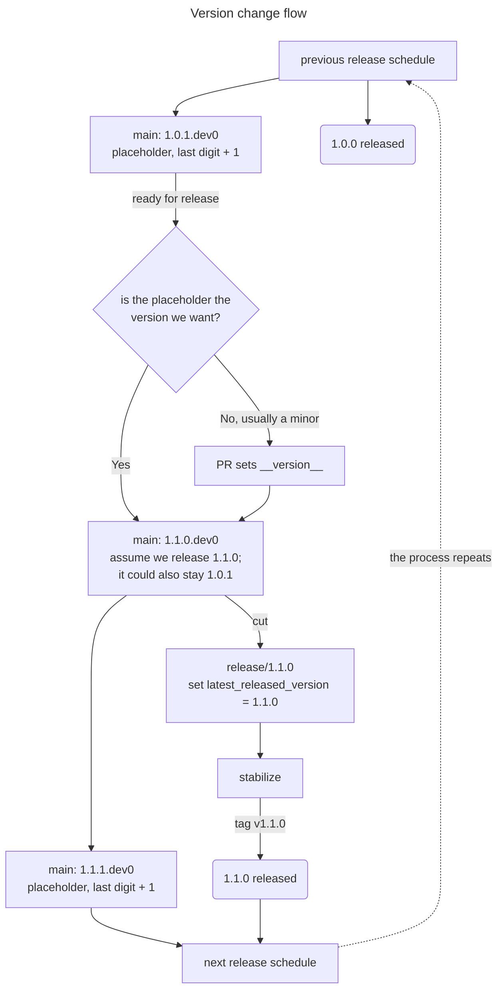

# Package Release Guide

Releases are cut and published by the [release managers team](https://github.com/orgs/apple/teams/coreai-optimization-release-managers).

The following commands are available locally:

```bash
make build      # build the artifacts for the current release to be published
make build-dev  # build a nightly or local development wheel (e.g. 1.1.0.dev202607231430+abc1234)
make version    # show the version a release would publish (e.g. 1.1.0)
make version-dev # show the development version carried on the tree (e.g. 1.1.0.dev0)
make clean      # remove build artifacts
```

## Version scheme

`main` always carries the version of the *next* release, never the one that already shipped.

There are three version formats:

| Format                                 | Example                         | What it is                                   |
| -------------------------------------- | ------------------------------- | -------------------------------------------- |
| `X.Y.Z`                                | `1.0.0`                         | a published release                          |
| `X.Y.Z.dev0`                           | `1.1.0.dev0`                    | the version `main` carries in the repo       |
| `X.Y.Z.dev<UTC-timestamp>+<short-sha>` | `1.1.0.dev202607231430+abc1234` | a dev artifact, built from a specific commit |

Say `1.0.0` has just been released. `main` then carries `1.0.1.dev0`. That reads as "working toward a release after `1.0.0`, which has not shipped": the `.dev0` suffix marks the tree as unreleased and never appears in a built wheel. Nothing on `main` can be mistaken for a published version.

`main`'s `.dev0` always defaults to the last digit plus one, so after `1.0.0` it is `1.0.1.dev0`. Once the version of the next release is known — usually a minor — a PR sets `__version__` to it before the release branch is cut.

The flow below traces one cycle. At the cut, `main` and the release branch diverge and never rejoin: the branch keeps the version it was cut with, and only `main` moves on.



`src/coreai_opt/_about.py` holds the last released version and `__version__`. Both are set together in one PR when `main` moves forward: the last released version becomes the release just branched, and `__version__` becomes the one after it. The `check-about-version` pre-commit hook enforces the relation between them: `__version__` must be the last released version with exactly one of its numbers raised by one, every number after that reset to zero, and `.dev0` on the end. From `1.0.0` it accepts `1.0.1.dev0`, `1.1.0.dev0`, or `2.0.0.dev0`, and nothing else. Any other value fails the commit, and the message prints the accepted ones, so there is nothing to work out by hand.

- `make build` builds the artifacts for the current release to be published.
- `make build-dev` builds the wheel for the nightly build, and local wheels for development and testing, each carrying a unique `.dev<UTC-timestamp>+<short-sha>` suffix.

Therefore, we have the following order:

```text
1.1.0.dev0 < 1.1.0.dev202607231430+abc1234 < 1.1.0
```

This is the order we want. `1.1.0.dev0` is the bare marker `main` carries, so it sorts below every wheel actually built for `1.1.0`. Each nightly sorts above it, and above the nightly before it, because the timestamp only grows. The published `1.1.0` sorts highest of all, so installers pick it over any dev wheel.

A release branch is the one place where the two match: it sets `latest_released_version` to the release it produces, so `__version__` is that same version plus `.dev0` rather than a next candidate. On `main` they always differ, which is what tells a release branch apart — and what lets a repo that vendors this one pin to a release branch and still resolve the right baseline.

`__version__` must always be a literal string, never an expression.

### Release branches

1. `release/<version>` is created from `main`, once the version of the next release has been decided — that is, which digit gets one added to it. Its first commit sets `latest_released_version` to that version, so the branch names its own release.
2. The tag is created on the `release/<version>` branch, never on `main`.
3. After the cut, `main` continues on to the next release's `.dev0`.
4. The `check-about-version` pre-commit hook enforces the version rules on every commit.
5. After the cut, the release branch takes no new commits, unless a must-fix issue comes up. Those commits are later cherry-picked back to `main`.

Cut the branch before moving `main` to the next dev release.

### Extending the scheme downstream

A repo that uses this one as a submodule and includes this `Makefile` — building one combined wheel from both trees — can add its own 4th number. Set `COREAI_OPT_VERSION_EXTENSION` to the number it's about to release next, then call `make build`, `make build-dev`, or `make version` unchanged.

The extension anchors the release to the last *published* release instead of the one `__version__` is working toward:

| `latest_released_version` | `__version__` | `COREAI_OPT_VERSION_EXTENSION` | Release built |
| ------------------------- | ------------- | ------------------------------ | ------------- |
| `1.0.0`                   | `1.1.0.dev0`  | unset                          | `1.1.0`       |
| `1.0.0`                   | `1.1.0.dev0`  | `1`                            | `1.0.0.1`     |
| `1.0.0`                   | `1.1.0.dev0`  | `2`                            | `1.0.0.2`     |

The extension is used exactly as given, and starts at `1`, not `0`. `make build-dev` adds the usual `.dev<UTC-timestamp>+<short-sha>` suffix on top.
