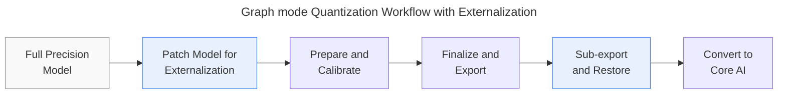

# Quantizing Models with Core AI Composite Ops in Graph Mode

Core AI recognizes certain well-known building blocks, such as SDPA or RMSNorm, as _composite ops_ and applies optimized implementations for them.
`coreai-torch` establishes those boundaries through _externalization_.
Refer to the [Externalization](https://apple.github.io/coreai-torch/main/guides/externalization.html) guide for details.
Here, we will discuss the steps required to quantize a model in `graph` mode using `coreai-opt`.

`graph`-mode quantization invokes `torch.export.export` under the hood, which decomposes a submodule's `forward` into aten ops.
In order to preserve the composite op structure during this process for externalization, the following APIs are provided:

- `_patch_model_for_externalization`: Patch the model **before** `quantizer.prepare`, so that the composite op call sites survive export and all subsequent quantization passes as opaque nodes.
- `_subexport_and_restore`: The submodule bodies of the composite ops themselves are then exported and restored before lowering to `CoreAI`.

Quantization treats each composite op as opaque, i.e., no fake-quantize op is placed inside the composite body.
The composite's input and output boundary can still be quantized, see [Quantizing the composite op boundary](#quantizing-the-composite-op-boundary) below for details.

:::{warning}
The externalization APIs used below, `_patch_model_for_externalization` and `_subexport_and_restore` in `coreai-torch` are currently experimental.
:::



## Step 1: Patch the model before prepare

`_patch_model_for_externalization` replaces the `forward` of every matching submodule in the model with a `torch.library.custom_op`, in place.
Call it before constructing the `Quantizer`.
The example below demonstrates this using the same `RMSNormComposite` op from the [Externalization](https://apple.github.io/coreai-torch/main/guides/externalization.html) guide, however, the same process applies for all composite ops with their respective `ExternalizeSpec`s.

```python
import torch
import torch.nn as nn
from coreai_torch import ExternalizeSpec, _patch_model_for_externalization


# The composite op
class RMSNormComposite(nn.Module):
    def __init__(self, axes=-1, eps=1e-5, version=1):
        super().__init__()
        self.axes = axes
        self.eps = eps
        self.version = version

    def forward(self, input: torch.Tensor, scale: torch.Tensor) -> torch.Tensor:
        x_f32 = input.to(torch.float32)
        inv_rms = torch.rsqrt((x_f32 * x_f32).mean(self.axes, keepdim=True) + self.eps)
        return (input * inv_rms).to(input.dtype) * scale


# A model that uses the composite op
class Model(nn.Module):
    def __init__(self, dim=32):
        super().__init__()
        self.proj = nn.Linear(dim, dim)
        self.norm = RMSNormComposite()
        self.norm_weight = nn.Parameter(torch.ones(dim))
        self.out = nn.Linear(dim, dim)

    def forward(self, x):
        return self.out(self.norm(self.proj(x), self.norm_weight))


model = Model().eval()
example_inputs = (torch.randn(1, 32),)

# Patch the model in-place
# to externalize the RMSNormComposite
_patch_model_for_externalization(
    model,
    targets=[
        ExternalizeSpec(
            target_class=RMSNormComposite,
            composite_op_name="rms_norm",
            composite_attrs=["axes", "eps", "version"],
        )
    ],
)
```

## Step 2: Prepare, calibrate and finalize

Nothing about the quantizer configuration or the calibration workflow changes.
The composite op holds no weights of its own here, so weight quantization applies to the surrounding `Linear` layers only.

```python
import coreai_opt as opt
from coreai_opt.quantization import ModuleQuantizerConfig, Quantizer, QuantizerConfig
from coreai_opt.quantization.spec import (
    default_activation_quantization_spec,
    default_weight_quantization_spec,
)

global_config = ModuleQuantizerConfig(
    op_state_spec={"weight": default_weight_quantization_spec()},
    op_input_spec={"*": default_activation_quantization_spec()},
    op_output_spec={"*": default_activation_quantization_spec()},
)
quant_config = QuantizerConfig(global_config=global_config)

quantizer = Quantizer(model, quant_config)
prepared_model = quantizer.prepare(example_inputs)

with quantizer.calibration_mode():
    for batch in calibration_dataloader:
        prepared_model(batch)

final_model = quantizer.finalize(backend=opt.ExportBackend.CoreAI)
```

## Step 3: Export and convert to Core AI

After quantization is complete and the model is finalized, `_subexport_and_restore` API exports each patched composite op and restores the original `forward` method in the model.
Note that the first argument to `_subexport_and_restore` is the original module that was patched in Step 1, not the finalized `GraphModule`.

```python
import coreai_torch
from coreai_torch import TorchConverter, _subexport_and_restore

exported_program = torch.export.export(final_model, example_inputs).run_decompositions(
    coreai_torch.get_decomp_table()
)
externalized = _subexport_and_restore(model, exported_program)

coreai_program = (
    TorchConverter()
    .add_exported_program(
        exported_program, _externalized_exported_programs=externalized
    )
    .to_coreai()
)
```

In the Core AI graph, the composite op is emitted as a separate private graph that `@main` reaches through `coreai.invoke`:

```text
// composite op body
coreai.graph private noinline @norm_57e2d4a8(%arg0: tensor<1x32xf32> {coreai.name = "input"}, %arg1: tensor<32xf32> {coreai.name = "scale"}) -> (tensor<1x32xf32>) attributes {composite_decl = ...} {
  %2 = coreai.decomposable.broadcasting_mul %0, %1 : (tensor<1x32xf32>, tensor<1x32xf32>) -> tensor<1x32xf32>
  %4 = coreai.reduce_mean %2, %3 : (tensor<1x32xf32>, tensor<1xsi32>) -> tensor<1x1xf32>
  %8 = coreai.decomposable.broadcasting_add %6, %7 : (tensor<1x1xf32>, tensor<f32>) -> tensor<1x1xf32>
  %9 = coreai.rsqrt %8 : tensor<1x1xf32> -> tensor<1x1xf32>
  %12 = coreai.decomposable.broadcasting_mul %10, %11 : (tensor<1x32xf32>, tensor<1x1xf32>) -> tensor<1x32xf32>
  %15 = coreai.decomposable.broadcasting_mul %13, %14 : (tensor<1x32xf32>, tensor<32xf32>) -> tensor<1x32xf32>
  coreai.output %15 : tensor<1x32xf32>
}

coreai.graph @main(%arg0: tensor<1x32xf32> {coreai.name = "x"}) -> (tensor<1x32xf32>) {
  %44 = coreai.decomposable.broadcasting_add %43, %2 : (tensor<1x32xf32>, tensor<32xf32>) -> tensor<1x32xf32>
  %53 = coreai.quantize %44, ... : (tensor<1x32xf32>, ...) -> tensor<1x32xsi8>
  %62 = coreai.dequantize %53, ... : (tensor<1x32xsi8>, ...) -> tensor<1x32xf32>

  // externalized composite op invocation
  %63 = coreai.invoke @norm_57e2d4a8(%62, %0) : (tensor<1x32xf32>, tensor<32xf32>) -> tensor<1x32xf32>
  %72 = coreai.quantize %63, ... : (tensor<1x32xf32>, ...) -> tensor<1x32xsi8>
  %81 = coreai.dequantize %72, ... : (tensor<1x32xsi8>, ...) -> tensor<1x32xf32>
  %84 = coreai.decomposable.broadcasting_batch_matmul %81, %83 : (tensor<1x32xf32>, tensor<32x32xf32>) -> tensor<1x32xf32>
}
```

(`coreai.cast`, `coreai.constant` and `coreai.reshape` ops omitted above for brevity.)

The composite body carries no `coreai.quantize` or `coreai.dequantize` op and stays in full precision.

## Quantizing the composite op boundary

The `coreai.quantize` pairs surrounding the `coreai.invoke` above come from the global config. They are the output quantizer of the preceding `Linear` and the input quantizer of the following one.
The composite op boundary itself is not targeted by the global config.

To target the boundary specifically, use `module_input_spec` and `module_output_spec` on a {class}`~coreai_opt.quantization.config.ModuleQuantizerConfig` scoped by `module_type_configs` or `module_name_configs`.

To see this in isolation, the following example uses a model with the composite op alone and specifies a module level spec to quantize it's boundary.

```python
from coreai_opt.quantization.spec import (
    PerTensorGranularity,
    QuantizationScheme,
    QuantizationSpec,
)


class RMSNormOnly(nn.Module):
    def __init__(self, dim=32):
        super().__init__()
        self.norm = RMSNormComposite()
        self.norm_weight = nn.Parameter(torch.ones(dim))

    def forward(self, x):
        return self.norm(x, self.norm_weight)


boundary_spec = QuantizationSpec(
    dtype=torch.int8,
    qscheme=QuantizationScheme.SYMMETRIC,
    granularity=PerTensorGranularity(),
)
quant_config = QuantizerConfig(
    module_type_configs={
        RMSNormComposite: ModuleQuantizerConfig(
            module_input_spec={"*": boundary_spec},
            module_output_spec={"*": boundary_spec},
        )
    },
)
```

Running the same patch, prepare, calibrate, finalize and convert steps as above, gives a `@main` graph containing just the boundary quantization and the composite call.

```text
coreai.graph private noinline @norm_20ea9665(%arg0: tensor<1x32xf32> {coreai.name = "input"}, %arg1: tensor<32xf32> {coreai.name = "scale"}) -> (tensor<1x32xf32>) attributes {composite_decl = ...} {
  %2 = coreai.decomposable.broadcasting_mul %0, %1 : (tensor<1x32xf32>, tensor<1x32xf32>) -> tensor<1x32xf32>
  %4 = coreai.reduce_mean %2, %3 : (tensor<1x32xf32>, tensor<1xsi32>) -> tensor<1x1xf32>
  %8 = coreai.decomposable.broadcasting_add %6, %7 : (tensor<1x1xf32>, tensor<f32>) -> tensor<1x1xf32>
  %9 = coreai.rsqrt %8 : tensor<1x1xf32> -> tensor<1x1xf32>
  %12 = coreai.decomposable.broadcasting_mul %10, %11 : (tensor<1x32xf32>, tensor<1x1xf32>) -> tensor<1x32xf32>
  %15 = coreai.decomposable.broadcasting_mul %13, %14 : (tensor<1x32xf32>, tensor<32xf32>) -> tensor<1x32xf32>
  coreai.output %15 : tensor<1x32xf32>
}

coreai.graph @main(%arg0: tensor<1x32xf32> {coreai.name = "x"}) -> (tensor<1x32xf32>) {

  // Input boundary quantizers for the composite op
  %13 = coreai.quantize %arg0, ... : (tensor<1x32xf32>, ...) -> tensor<1x32xsi8>
  %22 = coreai.dequantize %13, ... : (tensor<1x32xsi8>, ...) -> tensor<1x32xf32>

  // externalized composite op invocation
  %23 = coreai.invoke @norm_20ea9665(%22, %0) : (tensor<1x32xf32>, tensor<32xf32>) -> tensor<1x32xf32>

  // Output boundary quantizers for the composite op
  %32 = coreai.quantize %23, ... : (tensor<1x32xf32>, ...) -> tensor<1x32xsi8>
  %41 = coreai.dequantize %32, ... : (tensor<1x32xsi8>, ...) -> tensor<1x32xf32>
  coreai.output %41 : tensor<1x32xf32>
}
```

(`coreai.cast`, `coreai.constant` and `coreai.reshape` ops omitted above for brevity.)

## Notes

- The same set of APIs and steps apply for Quantization Aware Training in `graph` mode as well.
